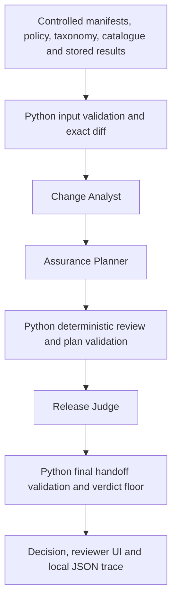

# Architecture

AgentGate retains the existing deterministic engine and three-stage handoffs.
The execution runner selects local adapters or Foundry-backed adapters through
the same `analyze`, `plan`, and `judge` interfaces.

## Exactly three specialized components

| Component | Foundry contribution | Python-owned fields |
| --- | --- | --- |
| Change Analyst | Concise explanation of the supplied exact diff | Release IDs, change paths/types/values, areas, risk categories, references |
| Assurance Planner | Rationale using the supplied controlled taxonomy, policy, catalogue and plan | Controls, required tests, missing evidence, human-review flag, references |
| Release Judge | Structured verdict recommendation and advisory explanation | Findings, evidence references, remediation and verdict floor |

A small strict JSON-schema response holds the model explanation; the judge
response also includes the verdict enum. The adapters assemble existing
`ChangeAssessment`, `AssurancePlan`, and `ReleaseDecision` contracts from
Python-owned data and the permitted model fields. Every assembled handoff is
revalidated by Pydantic and the workflow. The only handoff schema extension is
allowing `foundry` alongside `local_deterministic` as an execution-mode value.
The judge explanation is preserved in the trace rather than expanding the
existing decision contract.

The model cannot supply new evidence or remove blockers: its output schema has
no such fields and forbids extras. Final workflow validation additionally
compares findings, conditions, evidence and remediation with the deterministic
judge. Plan release IDs, risks, tests, evidence status and controls are checked
against the review. The cloud judge must return exactly the Python verdict;
a different recommendation is rejected, including any BLOCK downgrade.

## Cloud execution and failure handling

`AIProjectClient.get_openai_client()` sends project-scoped Responses requests
using the authenticated Azure CLI identity. This uses the existing deployment;
it does not register or host three new Azure agents. The three components are
application-level specializations with separate inputs and bounded outputs.

Each stage makes one request and can make one repair request if schema or
verdict validation fails. Refusal, empty/malformed output, invented fields and
wrong verdicts fail validation. Transport/authentication failures stop immediately;
there is no transport retry loop or silent model substitution. The workflow
returns a typed failure and the CLI exits with code 2. A failed run does not
produce an APPROVE, CONDITIONAL or BLOCK decision pretending to be cloud output.
Local mode remains available explicitly and requires no Azure dependencies.

Prompts treat supplied text as data and tell the model that stored PASS fixtures
do not prove safeguards exist. This reduces misleading prose but cannot make
natural-language explanations deterministically factual. The UI labels model
explanations advisory; only Python fields govern the decision.

## Trace and reviewer

`RunTrace` records a UTC timestamp, run ID, execution mode and overall status.
Each model-attempt span includes stage, attempt number, deployment, duration,
response ID, token usage and validation outcome. Accepted advisory model output
and the final validated decision are saved. Failures store exception class names,
not raw exception messages, HTTP payloads or credentials. The CLI saves a trace
in `finally`, including failed runs when `--trace` is supplied.

This intentionally small trace implementation uses only the standard library.
It is **application trace evidence**, not Azure portal telemetry. There is no
Application Insights export or provisioned telemetry resource.

The loopback HTTP server uses the same runner and returns validated results to a
single static page. Cloud execution requires a same-origin JSON POST. User/model
text is rendered with `textContent`, not inserted as HTML. There are no arbitrary
file paths or remote model configuration fields exposed by the UI. Downloads
contain the review, controlled manifests, stored evidence and trace.

## Existing deterministic scope

The controlled risk mapping and policy semantics are preserved. This is not a
general policy engine for arbitrary manifests or policies. No new assurance
results are invented or inferred by a model, and fixture PASS statuses do not
prove the corresponding control exists. The evaluation suite verifies the
controlled cases; required control/test expectations are subsets, since focused
cases can exercise one expectation within a larger set of findings.
